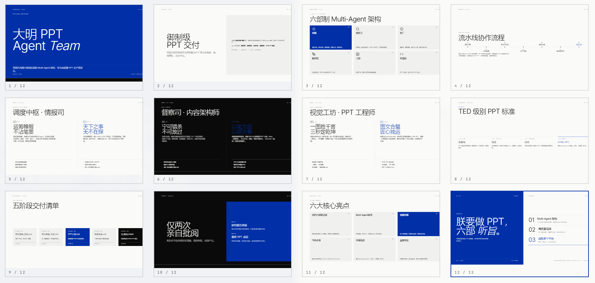
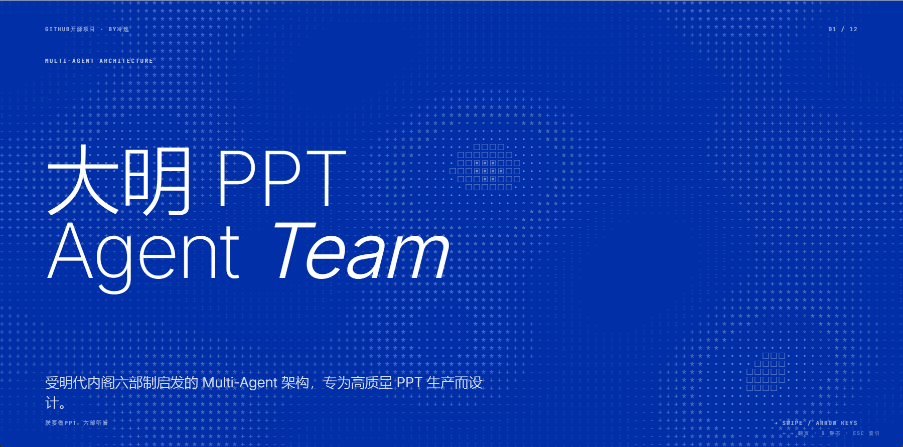
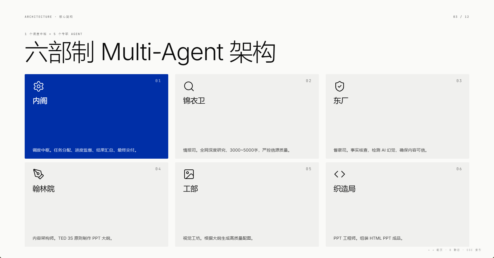
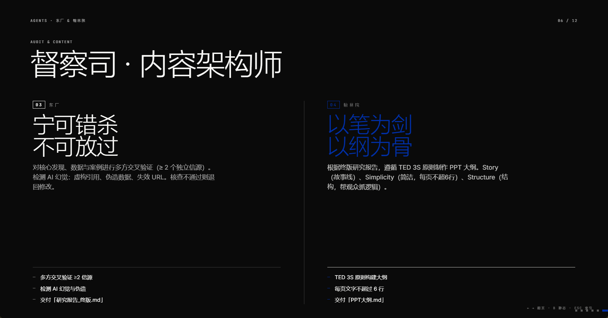
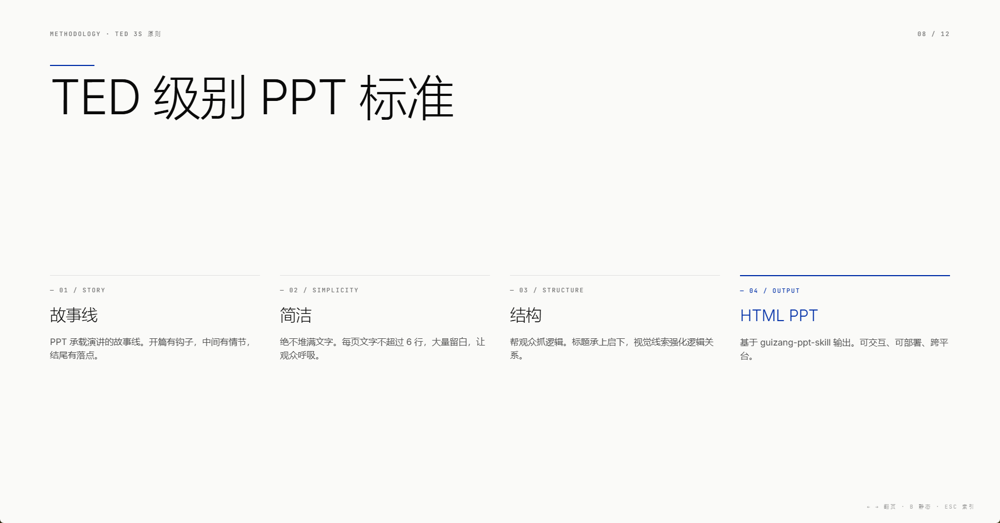
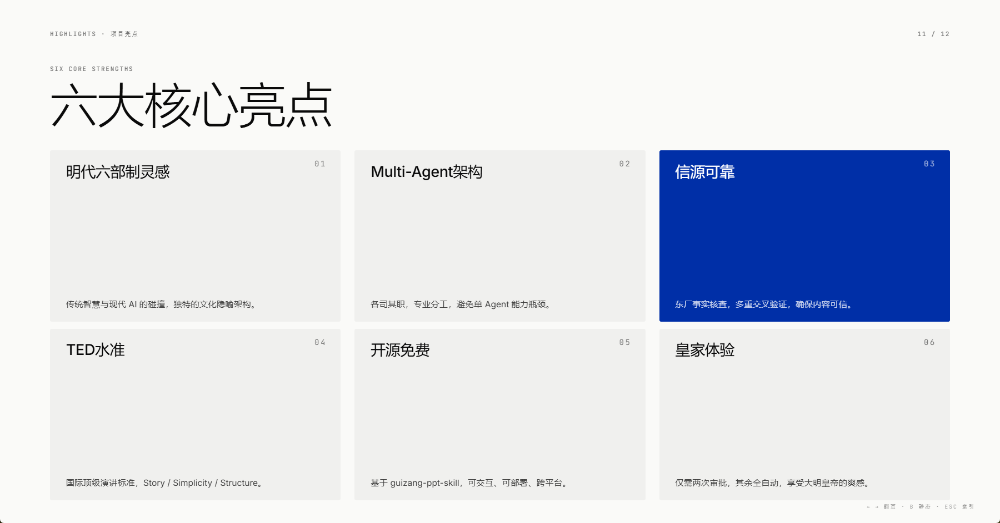

# DaMing PPT Agent Team

> The Emperor commands a PPT. All six ministries, hear the decree.

A **Multi-Agent architecture** inspired by the Ming Dynasty's six-ministry cabinet system, purpose-built for high-quality PPT production. It breaks down the complex content creation process into six specialized roles — each with a single responsibility — working in a coordinated pipeline to deliver presentation-grade output.

Agent collaboration flow: Deep Research → Fact-Checking → Content Outline → Image Generation → HTML PPT Output.

**中文版 →** **[README.md](./README.md)**

***

## Architecture Overview

The architecture consists of **1 orchestrator** + **5 specialist agents**, each with a dedicated role, collaborating in a pipeline:

|  #  |        Role       |      Position     | Core Function                                                           |
| :-: | :---------------: | :---------------: | ----------------------------------------------------------------------- |
|  0  |      Emperor      |        User       | Supreme decision-maker; approves key deliverables; holds veto power     |
|  1  |   Grand Council   |    Orchestrator   | Task dispatch, progress supervision, result aggregation, final delivery |
|  2  | Embroidered Guard |    Intelligence   | Deep web research; curates authoritative sources                        |
|  3  |   Eastern Depot   |    Fact-checker   | Audits research reports; eliminates AI hallucinations                   |
|  4  |   Hanlin Academy  | Content Architect | Transforms research into TED-style PPT outlines                         |
|  5  | Ministry of Works |   Visual Studio   | Generates high-quality images from the outline                          |
|  6  |   Weaving Bureau  |    PPT Engineer   | Assembles outline + images into the final HTML PPT                      |

***

## Full Workflow

```
Emperor issues decree (topic + requirements)
  │
  ▼
Grand Council receives order, breaks into subtasks, dispatches Embroidered Guard
  │
  ▼
Embroidered Guard conducts deep research (3,000–5,000 words)
  │
  ▼ Delivers「Research Report (Draft).md」
  │
Eastern Depot fact-checks ──→ Issues found? ──→ Returns to Embroidered Guard for revision
  │                                                   │
  │ (Passed)                                          ▼
  │                                    Embroidered Guard revises and resubmits
  ▼
Eastern Depot produces「Research Report (Final).md」
  │
  ▼
Emperor reviews report ──→ Rejected? ──→ Returned for new research
  │
  │ (Approved)
  ▼
Grand Council dispatches Hanlin Academy
  │
  ▼
Hanlin Academy creates「PPT Outline.md」following TED 3S principles
  │
  ▼
Grand Council simultaneously dispatches Ministry of Works & Weaving Bureau
  │
  ├──────────────────────────────┐
  ▼                              ▼
Ministry of Works           Weaving Bureau
generates images            waits for images
  │                              │
  ▼                              │
「Image List.md」+ files ──→────┘
                                 │
                                 ▼
                      Weaving Bureau assembles HTML PPT
                                 │
                                 ▼ Delivers「{topic}.html」
                                 │
                      Grand Council final review (no bugs, content correct)
                                 │
                                 ▼
                      Emperor final approval ✓ / ✗
```

***

## Agent Roles

### 1. Grand Council (Orchestrator)

> *"Plan from the command tent; never touch the brush."*

* Receives the Emperor's decree, breaks it into subtasks, and dispatches agents

* Monitors execution progress; handles timeouts, conflicts, and rework

* Coordinates image handoff between Ministry of Works and Weaving Bureau

* Performs final quality check before presenting to the Emperor

**Principle**: Dispatches, supervises, and reports — never executes concrete tasks itself.

***

### 2. Embroidered Guard (Deep Research)

> *"Nothing under heaven escapes our inquiry."*

* Conducts deep web research, 3,000–5,000 words, with strict source control

* Rates source credibility (High / Medium / Low); every claim has a URL

* Banned: unverified secondary sources, clickbait articles, unsourced content

**Deliverable**: `Research Report (Draft).md` → Eastern Depot

***

### 3. Eastern Depot (Fact-Checking)

> *"Better to over-check than to let falsehoods pass."*

* Cross-validates all key findings, data, and cases (≥ 2 independent sources)

* Detects AI hallucinations: fabricated citations, fake data, broken URLs

* Returns to Embroidered Guard for revision if checks fail

**Deliverable**: `Research Report (Final).md` → Emperor → Grand Council

***

### 4. Hanlin Academy (Content Architect)

> *"The pen as sword; the outline as skeleton."*

Turns the final research report into a PPT outline following the **TED 3S principles**:

| Principle  | Core Requirement               | Execution Standard                                             |
| ---------- | ------------------------------ | -------------------------------------------------------------- |
| Story      | PPT carries the narrative arc  | Hook at the open, buildup in the middle, landing at the end    |
| Simplicity | Never wall-to-wall text        | Max 6 lines per slide; generous white space                    |
| Structure  | Help audience follow the logic | Headlines bridge sections; visual cues reinforce relationships |

**Deliverable**: `PPT Outline.md` → Ministry of Works & Weaving Bureau

***

### 5. Ministry of Works (Visual Studio)

> *"One image speaks a thousand words; three seconds seal the deal."*

* Generates images only for slides marked "Recommended image: Yes" in the outline

* Quality bar: visually striking, meaning clear in 3 seconds, emotionally resonant

* Banned: clip art, stock photo dumps, decorative images unrelated to the topic

**Deliverable**: image files + `Image List.md` → Weaving Bureau

***

### 6. Weaving Bureau (PPT Engineer)

> *"Where text and image unite — craftsmanship at its finest."*

* Calls `guizang-ppt-skill` to assemble outline + images into an HTML PPT

* Applies "less is more" visual principles; one core message per slide

* Self-tests before handing off to Grand Council

**Deliverable**: `{topic}.html` → Grand Council

***

## Deliverables Summary

|     Phase     | Deliverable                   |    Produced by    |           Received by           |
| :-----------: | ----------------------------- | :---------------: | :-----------------------------: |
|    Research   | `Research Report (Draft).md`  | Embroidered Guard |          Eastern Depot          |
|   Fact-check  | `Research Report (Final).md`  |   Eastern Depot   |     Emperor → Grand Council     |
|    Outline    | `PPT Outline.md`              |   Hanlin Academy  | Grand Council → Works & Weaving |
|     Images    | image files + `Image List.md` | Ministry of Works |          Weaving Bureau         |
| Final product | `{topic}.html`                |   Weaving Bureau  |     Grand Council → Emperor     |

***

## Emperor Approval Gates

Only **2 checkpoints** require the user's direct review — the rest runs autonomously under Grand Council coordination:

1. **Final Research Report** — confirm research direction and factual accuracy
2. **Final PPT** — approve the finished product quality

***

## Repository Structure

```
DaMing-PPT-Agent-Team/
├── 1-内阁/               (Grand Council)
│   └── AGENTS.md         # Role prompt
├── 2-锦衣卫/             (Embroidered Guard)
│   └── AGENTS.md         # Role prompt
├── 3-东厂/               (Eastern Depot)
│   └── AGENTS.md         # Role prompt
├── 4-翰林院/             (Hanlin Academy)
│   └── AGENTS.md         # Role prompt
├── 5-工部/               (Ministry of Works)
│   └── AGENTS.md         # Role prompt
├── 6-织造局/             (Weaving Bureau)
│   └── AGENTS.md         # Role prompt
└── 大明PPT御制流程.md    # Full architecture design doc
```

***

## Supported Platforms

The role prompts (`AGENTS.md`) in this repo can be ported directly to the following Multi-Agent platforms:

| Platform                                  | Notes                                                                                                         |
| ----------------------------------------- | ------------------------------------------------------------------------------------------------------------- |
| [MiniMax Agent](https://agent.minimax.io) | Import each `AGENTS.md` content as an Agent system prompt                                                     |
| [Codex](https://codex.openai.com)         | Configure prompts as the system prompt for each Codex Agent; pair with tool calls for research and generation |
| [WorkBuddy](https://workbuddy.ai)         | Create one Agent per pipeline stage in a WorkBuddy workflow and paste the corresponding prompt                |
| [OpenClaw](https://openclaw.ai)           | Configure agents in sequence by role number in OpenClaw's multi-agent orchestration UI                        |
| [Hermes](https://hermes.ai)               | Run in Hermes Agent Chain mode; each chain node maps to one role prompt                                       |

> **Universal rule**: every `AGENTS.md` file is a self-contained system prompt — paste it into any platform that supports custom system prompts and it will work.

***

## Showcase

Below are real-world HTML PPT outputs generated by this architecture:

|  |  |
|:---:|:---:|
|  |  |
|  |  |
|  |  |

***

## Quick Start

### Step 1: Clone the Repository

```bash
git clone https://github.com/your-username/DaMing-PPT-Agent-Team.git
cd DaMing-PPT-Agent-Team
```

### Step 2: Configure Each Agent

Create the following 6 agents in your platform of choice, using the corresponding `AGENTS.md` file as the system prompt:

| Order | Agent Name              | Prompt File       |
| :---: | ----------------------- | ----------------- |
|   1   | Grand Council (内阁)      | `1-内阁/AGENTS.md`  |
|   2   | Embroidered Guard (锦衣卫) | `2-锦衣卫/AGENTS.md` |
|   3   | Eastern Depot (东厂)      | `3-东厂/AGENTS.md`  |
|   4   | Hanlin Academy (翰林院)    | `4-翰林院/AGENTS.md` |
|   5   | Ministry of Works (工部)  | `5-工部/AGENTS.md`  |
|   6   | Weaving Bureau (织造局)    | `6-织造局/AGENTS.md` |

### Step 3: Enable Tool Permissions

Enable the following tools for each agent based on their role:

| Agent             | Recommended Tools                             |
| ----------------- | --------------------------------------------- |
| Embroidered Guard | Web search (Exa / Tavily / Brave Search)      |
| Eastern Depot     | Web search, URL validation                    |
| Ministry of Works | Image generation (Image 2 / Seedream 5 / Banana 2 / Midjourney) |
| Weaving Bureau    | File read/write, HTML rendering               |

### Step 4: Start the Pipeline

Send the following message to the **Grand Council** agent to kick off the full workflow:

```
Topic: [your PPT topic]
Requirements: [optional additional requirements]
```

Grand Council will automatically coordinate the other five agents through the full pipeline, pausing at the 2 approval gates for your review.

***

## About the Project

The overall architecture of this project was originally designed by Lengyi. Depends on `guizang-ppt-skill` to render the HTML PPT.

Design philosophy:

* **Single responsibility**: each agent does exactly one thing, and does it well

* **Quality gates first**: research is double-checked (Embroidered Guard + Eastern Depot) before the outline stage begins

* **Minimal human touch**: only 2 approval gates; everything else is fully automated

***

## About the Author

**Lengyi (冷逸)** — host of 「沃垠AI」, one of China's top AI WeChat accounts. A no-code Vibe Coding developer who obsessively refines prompts, Skills, and Agent architectures.

* Unified handle across all platforms: **沃垠AI**

* Background: product & operations; AI developer; prolific OPC creator

* Active on: WeChat Official Account, Xiaohongshu, Zhihu, GitHub, Bilibili, X

Scan to follow the WeChat account for more Agent architectures and AI workflow content:


***

## License

This project is open-sourced under the [MIT License](LICENSE). You are free to use, modify, and redistribute it. For commercial use, please obtain authorization in advance.
